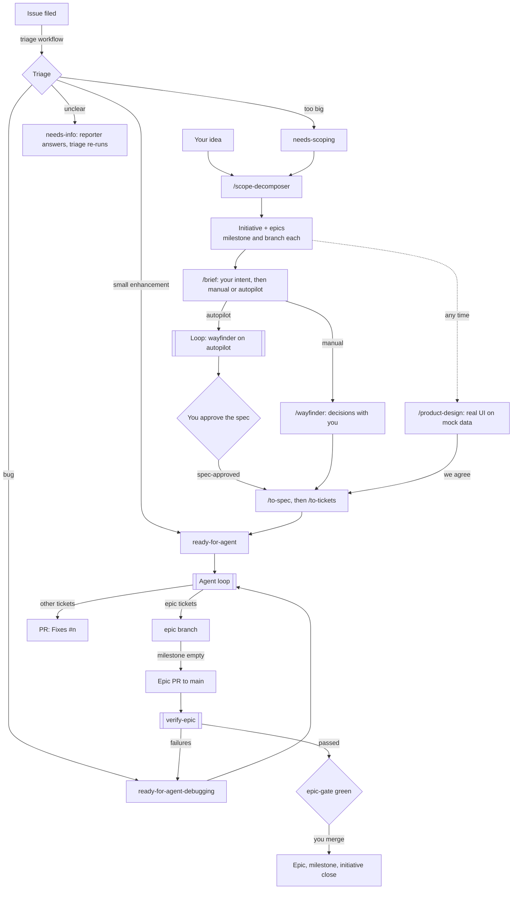

# How work flows

From an idea, or an issue a teammate files, to merged code: who does each step (you, an agent, or a workflow), which skill or command runs it, and what it leaves behind.

To actually start a project, follow [Running a new project](new-project.md); this page explains how the pieces fit.

## Who does what

| Step | Who | How |
| --- | --- | --- |
| Classify new issues | Workflow | Automatic triage on every new issue |
| Break a big idea into epics | You + agent | `/scope-decomposer` |
| Say what you have in mind for an epic; pick manual or autopilot | You + agent | `/brief` |
| Make the decisions an epic needs | You + agent, or agents alone on autopilot | `/wayfinder <epic>` (`/dig Q<n>` for hard questions), or the loop for `autopilot` epics |
| Agree on the UI | You + agent | `/product-design <epic>` |
| Turn decisions into tickets | Agent | `/to-spec`, then `/to-tickets` |
| Build tickets, fix bugs | Agents | The agent loop (`npm run agents`) on your laptop or the always-on Mac |
| Test the finished epic | Agent | `verify-epic`, run by the loop |
| Approve and merge | **You** | Review the epic PR once `epic-gate` is green |
| Close what's done | Workflow | The closing chain |

You decide; agents do the legwork; workflows keep the tracker tidy. Nothing reaches `main` without your merge.

## The stages

**1. Intake.** Anyone files an issue. [Automatic triage](../README.md#automatic-triage) labels it with what it is and who acts next, and comments its reasoning: a small `enhancement` goes to agents (`ready-for-agent`, with a brief), a `bug` to agents (`ready-for-agent-debugging`), anything big to `needs-scoping`, anything unclear back to the reporter (`needs-info`). You can always re-run or override it with `/triage #n`.

**2. Scope.** A big idea, yours or a `needs-scoping` issue, goes through `/scope-decomposer`: a high-level interview, then an **initiative** issue with **epics** under it. Each epic has one destination, one area (and so one owner), its own milestone (`NN: Initiative / Epic`) and branch (`epic/NN-slug`), and blocking links to the epics it waits on. Parts too vague to bound stay in the initiative's "Not yet scoped" list until a later run.

**3. Brief.** Every new epic waits for a `/brief` (`needs-briefing` + `ready-for-human`): a short, high-level grilling session where you say what you already have in mind, saved in the epic's Brief section, the glossary and ADRs. A must-have that's really its own epic becomes one through `/scope-decomposer`. The brief ends with your choice: **manual** (you plan it with `/wayfinder`) or **autopilot** (the `autopilot` label: the agent loop plans it).

**4. Plan.** For each epic, in build order: `/wayfinder <epic>` charts the decisions it needs and works through them with you, one at a time (`/dig` researches a question you can't settle on instinct). `/product-design <epic>` can run at any point to build the real UI on mock data until you say "we agree". Both leave their decisions on the tracker. On an `autopilot` epic the agent loop runs wayfinder alone: the Brief's lines are your decisions, confident answers are taken directly, uncertain ones after `dig`, the rest marked *assumed*. You then review just the spec, which lists every decision the agent took, least confident first, and approve it with the `spec-approved` label.

**5. Tickets.** Once the way is clear, `/to-spec` writes the spec and `/to-tickets` cuts it into tickets labelled `ready-for-agent`, each in the epic's milestone, with its blockers. `/product-design` does the same for the agreed UI.

**6. Build.** The [agent loop](../README.md#agent-loop) picks up every ready, unblocked ticket, plans which can run in parallel, and works each in a Docker sandbox with `implement` (tests first, then `code-review`). Epic tickets land on the epic branch and close; other tickets arrive as PRs. Run it on your laptop while you work and on the [always-on Mac](mac-setup.md); assignment keeps them from taking the same ticket. A ticket an agent can't finish goes to `ready-for-human` with an explanation.

**7. Bugs.** Bugs from triage or from verification are `ready-for-agent-debugging`. The loop runs `debug-and-fix`: reproduce (in a browser for UI bugs), find the cause, fix with a regression test when the diagnosis is clean, otherwise leave the diagnosis for a person. Run it by hand with `/debug-and-fix #n`.

**8. Verify and ship.** When an epic's milestone has no open tickets, the loop opens the epic's PR to `main` and runs `verify-epic` in the running app: acceptance criteria, user stories, API contracts, agreed screens. Failures become bug tickets under the epic, the loop fixes them, and verification runs again. `epic-gate` turns green when nothing is open, no `mocks/` folder is left and verification passed. **You review and merge.** The epic closes, then its milestone, then the initiative when it was the last epic (unless parked areas remain).

**9. Upkeep.** `/update-from-upstream` brings in the latest from the skill authors this repo follows, keeping your customizations. Changes to the skills go through PRs with a changeset, and merging the "version skills" PR releases them ([Releasing](../README.md#releasing)).

## Labels

| Label | Means | Next |
| --- | --- | --- |
| `needs-triage` | Triage hasn't finished | Triage, or `/triage #n` |
| `bug` / `enhancement` / `needs-scoping` / `needs-info` / `wontfix` | What the issue is | |
| `ready-for-agent` | Agents build it | The agent loop |
| `ready-for-agent-debugging` | Agents debug it | The agent loop (`debug-and-fix`) |
| `ready-for-human` | A person acts next | The assignee |
| `ready-for-review` | A fix PR waits | Review the linked PR |
| `initiative` / `epic` | Planning issues from `/scope-decomposer` | |
| `needs-briefing` | An epic waiting for its brief | `/brief` |
| `autopilot` | An epic the agent loop plans by itself | The agent loop |
| `spec` | A spec, turned into tickets by `/to-tickets` | |
| `spec-approved` | You approved an autopilot spec | The loop cuts its tickets |
| `wayfinder:*` | A wayfinder map and its decision tickets | `/wayfinder` |
| `area:*` | Which part of the product, and so who owns it | `docs/agents/team.md` |

An assignee means **claimed**: someone (or some agent) is working on it now. Agent tickets stay unassigned until claimed.

## Branches

| Branch | Holds | Merges into |
| --- | --- | --- |
| `epic/NN-slug` | Everything for one epic | `main`, through the epic PR |
| `agent/issue-n` | One agent's ticket, briefly | The epic branch |
| `feat/n`, `fix/n` | A ticket outside any epic | `main`, through its PR |
| `design/NN-slug` | The agreed screenshots | Never |

## Where the project's settings live

Written by `/setup-imick-skills`, all editable by hand:

| File | Says |
| --- | --- |
| `docs/agents/issue-tracker.md` | Where issues live and how skills use them |
| `docs/agents/triage-labels.md` | The label strings |
| `docs/agents/team.md` | Areas, owners, people |
| `docs/agents/domain.md` | Where the glossary and ADRs live |
| `docs/agents/preview.md` | Where `verify-epic` finds the running app |
| `.github/workflows/triage.yml`, `epics.yml` | Automatic triage; the epic gate and closing chain |
| `.sandcastle/` | The agent loop (secrets in `.sandcastle/.env`, never committed) |
